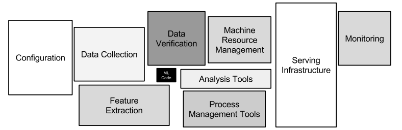

# Production-Level-Data-Analysis

Here we use adults income dataset as example

Model Developing Process

1. Data Collection (You will denmamize customers personal information from database)

2. ETL (transform the format you need and store in feature store)

3. EDA (You can use TFDV to validate the data)

4. Model Development/Evaluation (dvc, mlflow, microsoft responsible AI toolkit)

5. Once done model development, developing CI/CD/CT for the model (mlrun, tfx, kubeflow pipeline, github actions)
CI with github actions:

https://github.com/kubeflow/examples/tree/master/pipelines/github_action

https://github.com/marketplace/actions/kubeflow-compile-deploy-and-run

6. Deploy the model and monitor it (Seldon Core(outlier detection, explainer), Prometheus, on kubernetes)

7. Retrain the model when new data is available or concept drift happened (Kubeflow Pipeline, here we use the other half data)

8. When updating the code of retraining pipeline or detecting concept drift, trigger github actions to test the retraining pipeline, followed by CD to the test environment and finally deploy it in production 

You can use streamlit as the interface to check the api

1. prediction result
2. explain the result
3. data drift alert

you can also check the statistics of the model by deploying prometheus and grafana

